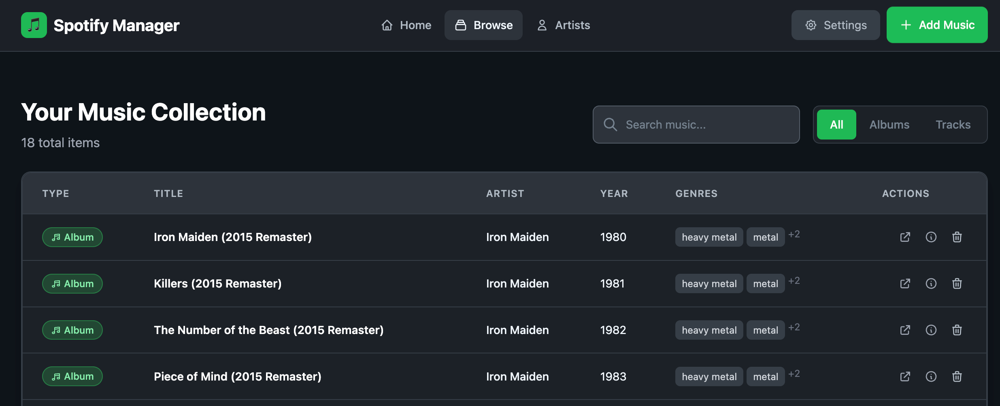

# spotify-manager

A python application to manage spotify albums and tracks using the Spotify API

Code is a work-in-progress and will be published as soon as it is in a usable state

## Why

Maybe it's just me, but managing my favorite albums and tracks through the Spotify application confuses (annoys) me. I was looking for a convenient way to manage my collection and I didn't want to use Excel. It was a nice project for me to improve my python skills. Plus, I was testing Github Copilot while writing the code.  

### Short-term goals/features and status

- [x] Insert spotify albums and tracks by its URL to the database
- [x] Uses the official Spotify API via spotipy
- [x] Metadata to add: artist, album, genre, release year, uri and url
- [x] Very basic/simple import/export function
- [x] Build a small web UI to manage the items in the database
- [x] Browsing and adding items in the web interface

### Todos

- [ ] Dockerize it
- [ ] Better usability if the collection is getting bigger

### Screenshot

## Installation  

1. Get a spotify developer API key from: <https://developer.spotify.com/>
2. Pull the repository and `cd` into it
3. Create a `.env` file with `SPOTIPY_CLIENT_ID` and `SPOTIPY_CLIENT_SECRET` (and put your API keys there)
4. Create python environment with `python3 -m venv .venv`
5. Activate your python environment!
6. Install the pip requirements:`pip install -r requirements.txt`
7. Start the app with `python app.py` or with `gunicorn -w 4 -b 0.0.0.0:5000 wsgi:app` (`pip install gunicorn`)

The app will run at <http://127.0.0.1:5000>
